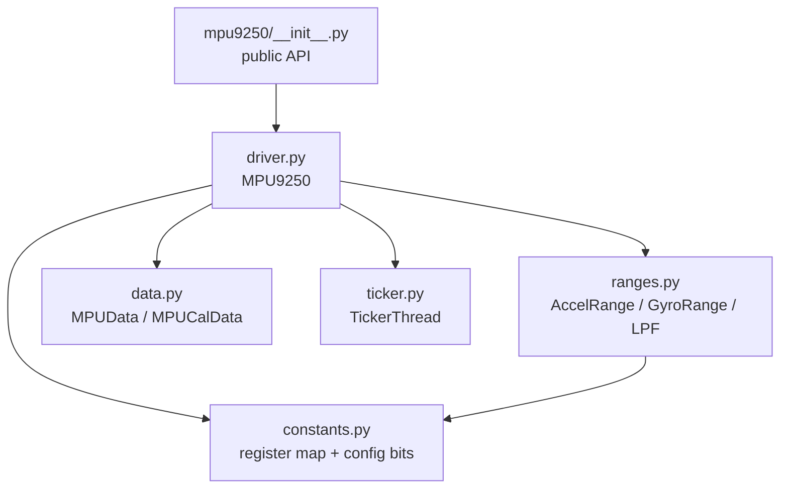
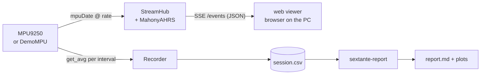
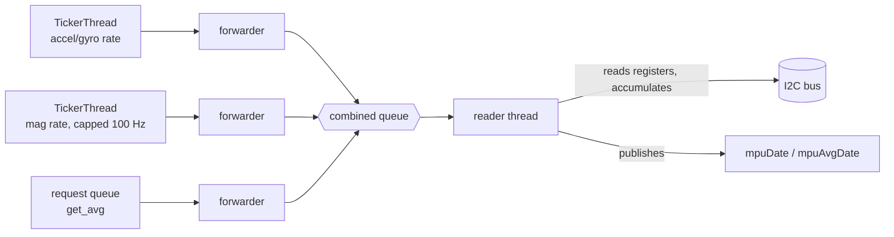
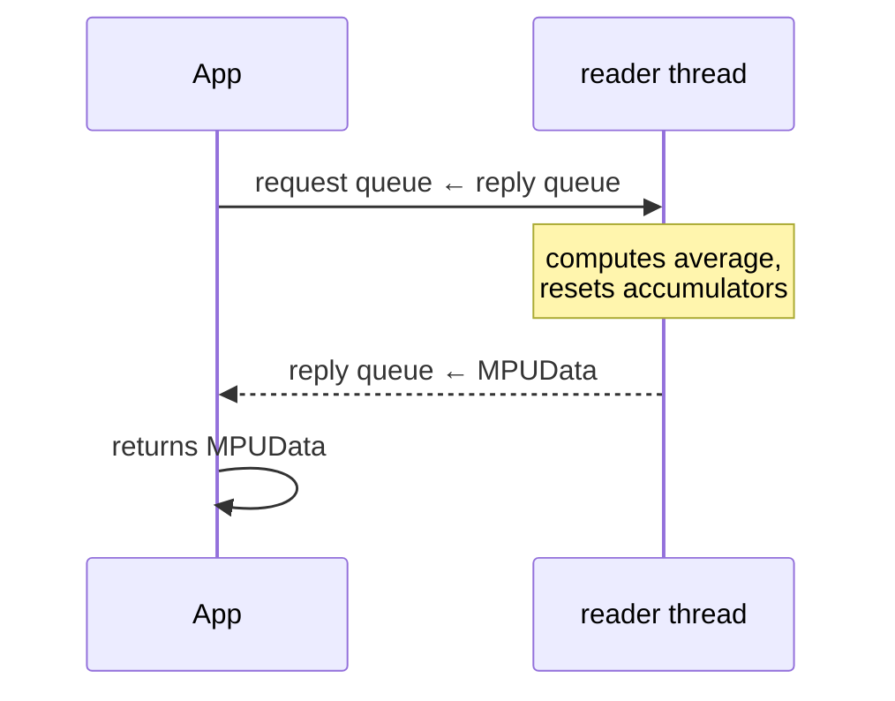

# Driver architecture

How sextante is put together and why. For the hardware facts underneath, see
[hardware.md](hardware.md).

## Module map



| Module | Responsibility |
|--------|----------------|
| `driver.py` | Chip setup, self-check, the sampling loop, averaging, bus I/O |
| `constants.py` | Every register address and configuration bit, named after the datasheet |
| `ranges.py` | Full-scale range definitions (bits + LSB scale) and low-pass filter selection |
| `data.py` | Value objects: a reading (`MPUData`) and user calibration (`MPUCalData`) |
| `ticker.py` | Drift-free periodic tick source used by the sampling loop |
| `fusion.py` | Mahony AHRS attitude filter and quaternion helpers |
| `recorder.py` | CSV session recorder (the one `get_avg()` consumer) |
| `report.py` | Session loading, analysis metrics and Markdown/PNG rendering |
| `streamer.py` | Sampling hub + fusion + SSE HTTP server; serves the viewer |
| `demo.py` | Synthetic motion source, drop-in for `MPU9250` |
| `cli.py` | `sextante-record` / `sextante-stream` / `sextante-report` |
| `web/viewer.html` | Self-contained live viewer (hand-rolled canvas 3D, no libraries) |

The I2C bus is **injected** (`MPU9250(bus=...)`); `smbus2` is imported lazily only
when no bus is given. That single seam is what makes the whole test suite run
without hardware.

## Data pipeline

Everything downstream of the driver consumes one of its two reading surfaces —
instantaneous `mpuDate` or interval-averaged `get_avg()`:



- **`get_avg()` has exactly one consumer** — it resets the interval accumulators,
  so the `Recorder` owns it; the `StreamHub` reads `mpuDate` and never interferes.
  Recording and streaming therefore run simultaneously.
- **Fusion runs on the Pi**, not in the browser: the hub feeds the Mahony filter at
  the sample rate and every SSE client receives the same fused quaternion, so N
  viewers cost N serializations, not N filters.
- The streamer is **pure standard library** (`ThreadingHTTPServer` + Server-Sent
  Events) and the viewer is one self-contained HTML file served from package data —
  nothing to install on the PC, no CDN, works offline.
- `DemoMPU` derives gyro/accel/mag from a single analytic attitude path, so the
  fusion tests can close the loop: generate → fuse → compare against ground truth.

## Runtime model

After `initialize()`, one background **reader thread** owns all I2C traffic. It
multiplexes three event sources into a single queue — a `select` over channels,
inherited from the driver's Go ancestry (goflying/stratux), expressed with
`queue.Queue` and forwarder threads:



Per event:

- **accel/gyro tick** — read the six gyro/accel words and the temperature
  (big-endian), scale the freshest magnetometer values, publish an instantaneous
  `MPUData` in `mpuDate`, add everything to the running accumulators.
- **mag tick** — read the status + data bytes the aux master copied into
  `EXT_SENS_DATA` (`ST1`, the three little-endian words, `ST2`); skip the sample
  unless `ST1.DRDY` says it's fresh and `ST2.HOFL` confirms no magnetic overflow,
  then apply the per-axis factory sensitivity, remap into the accel/gyro frame and
  accumulate. The mag rate is capped at 100 Hz, the AK8963's maximum.
- **request** — compute the interval average, hand it back, reset the accumulators.

All sampling state (accumulators, counters, timestamps) lives in **locals of the
reader loop**, not on the object — nothing else may touch it, so there are no locks.

## The `get_avg()` contract

`get_avg()` is synchronous by design: the caller gets the average of *everything
sampled since the previous call*, computed at the moment of the request.



The reply travels on a queue created per call, so concurrent callers can't steal
each other's answers. The previous design returned `mpuAvgDate` immediately after
*queuing* the request — every caller read the **previous** interval's data, one full
poll behind reality.

## Data path

```
raw register pair ──► int16 (endianness per die) ──► − hardware bias (MPUCalData)
   ──► × range scale (LSB → physical unit) ──► MPUData  [°/s, g, µT, °C]
```

The magnetometer additionally multiplies by the per-axis factory sensitivity
(`mcal1..3`, from the AK8963 fuse ROM) and is remapped into the accel/gyro frame
(see [hardware.md → Axes](hardware.md#axes-the-magnetometer-frame-is-rotated)) before
bias subtraction and the 3×3 `Ms` rescaling matrix — identity by default, the hook
where hard-iron/soft-iron calibration plugs in.

## Design decisions

- **Polling, not FIFO/interrupts.** The FIFO and interrupt paths are disabled and the
  driver reads output registers on its own clock. Simpler, and accurate enough at
  ≤ 200 Hz; the cost is sensitivity to scheduler jitter, mitigated by the
  monotonic-clock ticker.
- **Hardware self-check before configuration.** `initialize()` refuses to configure
  a chip whose `WHO_AM_I`/`WIA` don't match (relabeled MPU-6500 boards are common);
  `initialize(check_hardware=False)` opts out.
- **One reader thread owns the bus.** After `initialize()`, no other thread issues
  I2C transactions, so transactions never interleave. Corollary: one `MPU9250`
  instance per bus.
- **Daemon threads.** Sampling never blocks process exit; there is no shutdown
  ceremony to forget.
- **Value objects out, calibration in.** Readers get immutable-in-practice
  `MPUData` snapshots; calibration enters only through `MPUCalData` before
  `initialize()`.

## Known limitations

- `DT` in `MPUData` measures wall-clock interval, not sample count × period; under
  heavy CPU load the effective rate can droop silently.
- One instance per bus is assumed, not enforced.
- Polling caps the useful rate well below what the FIFO/interrupt path could reach.

These are the roadmap items, in priority order.
