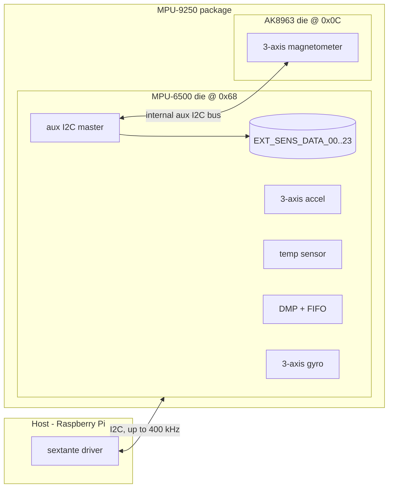
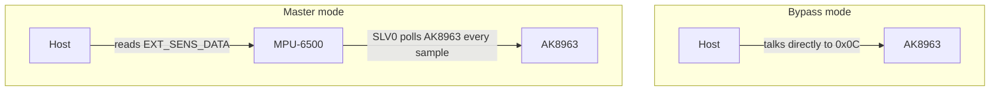

# The hardware: what the MPU-9250 actually is

This document collects the hardware facts the driver is built on. Registers, values
and timings come from the InvenSense *MPU-9250 Product Specification* (PS-MPU-9250A-01),
the *MPU-9250 Register Map* (RM-MPU-9250A-00) and the AKM *AK8963 datasheet*.

## One package, two chips

The MPU-9250 is not a single sensor — it is a **System-in-Package** with two
independent silicon dies:

- an **MPU-6500**: 3-axis gyroscope, 3-axis accelerometer, temperature sensor,
  a DMP (Digital Motion Processor) with FIFO, and an **auxiliary I2C master**;
- an **AK8963** (Asahi Kasei): 3-axis Hall-effect magnetometer.

Everything about the magnetometer follows from this: the AK8963 is a **separate I2C
device** at address `0x0C`, with its own register map, its own conversion timing
(max 100 Hz), its own factory calibration and — as described below — **its own axis
orientation**.

## Buses and addresses

| Device | Address | Notes |
|--------|---------|-------|
| MPU-6500 die | `0x68` | `0x69` when the AD0 pin is pulled high |
| AK8963 die | `0x0C` | Only visible to the host in bypass mode |

The MPU-6500 also speaks SPI, but the AK8963 is I2C-only; this driver uses I2C for
everything.

## Two ways to reach the magnetometer

**Bypass mode** (`INT_PIN_CFG.BYPASS_EN` set, `USER_CTRL.I2C_MST_EN` cleared)
electrically connects the auxiliary bus to the host bus, so the host addresses the
AK8963 directly at `0x0C`. The driver uses it in two places, both before sampling
starts:

- `self_check()` — reading the AK8963 `WIA` (device id) register;
- reading the factory sensitivity values (`ASAX/Y/Z`) from the AK8963 fuse ROM, and
  then starting **continuous measurement mode** (100 Hz, 16-bit) before bypass is
  closed.

**Master mode** is how sampling runs: the AK8963 free-runs at 100 Hz, and the MPU's
auxiliary I2C master is programmed (slave 0) to copy `ST1..ST2` — status and data,
8 bytes — into `EXT_SENS_DATA_00..07` on every internal sample, where the host reads
them together with the gyro/accel output. `ST1.DRDY` tells the driver whether the
sample is fresh; `ST2.HOFL` flags magnetic overflow (both checked per read).

The two modes are mutually exclusive — mixing them up (e.g. writing `SLV0` registers
while in bypass) silently does nothing useful, which is exactly the class of bug this
driver once had.

## Registers this driver touches

| Register(s) | Purpose |
|-------------|---------|
| `PWR_MGMT_1/2` (0x6B/0x6C) | Reset, wake, clock source (PLL), sensor enables |
| `WHO_AM_I` (0x75) | Die identification (`self_check()`) |
| `SMPLRT_DIV` (0x19) | Sample rate divider: rate = 1000 / (1 + div) Hz |
| `CONFIG` (0x1A) | Gyro digital low-pass filter |
| `GYRO_CONFIG` (0x1B) | Gyro full-scale range |
| `ACCEL_CONFIG` (0x1C) | Accel full-scale range |
| `ACCEL_CONFIG_2` (0x1D) | Accel low-pass filter, FIFO size bit |
| `ACCEL/TEMP/GYRO_*OUT` (0x3B–0x48) | 16-bit output registers, big-endian pairs |
| `I2C_MST_CTRL`, `I2C_SLV0_*`, `I2C_MST_DELAY_CTRL` | Aux master setup for the AK8963 |
| `EXT_SENS_DATA_00..07` (0x49–0x50) | Magnetometer bytes copied by the aux master |
| `USER_CTRL` (0x6A), `INT_PIN_CFG` (0x37) | Master/bypass mode switching |
| `FIFO_EN` (0x23), `INT_ENABLE` (0x38) | Both disabled — the driver polls |
| `BANK_SEL`/`MEM_R_W` (0x6D/0x6F) | DMP memory writes (disable gyro bias compensation) |
| AK8963 `WIA`, `CNTL1`, `ASAX/Y/Z`, `HXL..HZH`, `ST1/ST2` | Magnetometer id, mode, fuse ROM, data, status |

## Data formats: the endianness trap

All sensor outputs are **16-bit two's complement**, but the two dies disagree on
byte order:

| Source | Byte order | Example |
|--------|-----------|---------|
| MPU-6500 (gyro/accel/temp) | **Big-endian** — `_H` register first | `GYRO_XOUT_H` then `GYRO_XOUT_L` |
| AK8963 (magnetometer) | **Little-endian** — `L` register first | `HXL` then `HXH` |

SMBus word reads are little-endian, so they match the AK8963 but **byte-swap every
MPU-6500 value** — at rest, +1 g (`0x4000`) reads back as 64, and tiny tilts flip the
sign wildly. The driver reassembles MPU words explicitly (`_be_word_to_int16`) and
keeps plain word reads for the magnetometer. If readings ever look like noise that
ignores movement, suspect endianness first.

## Scale factors and units

| Quantity | Full scale | Scale | Driver output |
|----------|-----------|-------|---------------|
| Gyro | ±250 / 500 / 1000 / 2000 °/s | FS / 32767 per LSB | °/s |
| Accel | ±2 / 4 / 8 / 16 g | FS / 32767 per LSB | g |
| Magnetometer | ±4912 µT | 0.15 µT/LSB (16-bit mode), × per-axis fuse-ROM factor | µT |
| Temperature | — | 1 / 333.87 °C per LSB, +21 °C offset | °C |

The AK8963 fuse ROM holds three per-axis sensitivity adjustment bytes (`ASAX/Y/Z`,
typically ~170–180) programmed at the factory; the driver folds them into `mcal1..3`
at startup.

## Axes: the magnetometer frame is rotated

Per the datasheet orientation diagram, the AK8963 axes do **not** coincide with the
accel/gyro axes:

| Magnetometer axis | Equals accel/gyro axis |
|-------------------|------------------------|
| X | **+Y** |
| Y | **+X** |
| Z | **−Z** |

The driver **remaps automatically**: each sample is put into the accel/gyro (body)
frame right after the per-axis factory sensitivity is applied, so `M1/M2/M3` in
`MPUData` share the frame of `A*`/`G*`. Consequently the `MPUCalData` magnetometer
biases (`M0*`) and the `Ms` rescaling matrix operate **in the body frame** — use
them for hard-iron/soft-iron calibration, never for axis fixing.

## Identification: is your chip real?

TDK InvenSense discontinued the MPU-9250 years ago (the designated successor is the
ICM-20948). A large share of boards sold as "MPU-9250" today carry **relabeled or
counterfeit dies** — very often an MPU-6500 with no magnetometer at all. The way to
know what you actually have:

| `WHO_AM_I` (0x75) | Chip |
|--------------------|------|
| `0x71` | MPU-9250 (genuine) |
| `0x73` | MPU-9255 (same driver works) |
| `0x70` | MPU-6500 — **no magnetometer**; common relabel |
| `0x68` | MPU-6050 (older, 3.3 V-only I2C part) |

…and the AK8963 must answer `0x48` in its `WIA` register (readable in bypass mode).
`MPU9250.self_check()` performs both checks and raises `HardwareMismatchError` with
a diagnosis; `initialize()` runs it by default.

## Electrical notes

- VDD 2.4–3.6 V (3.3 V typical). Most breakouts include a regulator; check before
  feeding 5 V.
- I2C up to 400 kHz (fast mode). Breakouts usually carry pull-ups already.
- Typical consumption is ~3.5 mA with all nine axes running — irrelevant for a Pi,
  relevant for battery designs.

## References

- TDK InvenSense, *MPU-9250 Product Specification*, PS-MPU-9250A-01.
- TDK InvenSense, *MPU-9250 Register Map and Descriptions*, RM-MPU-9250A-00.
- Asahi Kasei Microdevices, *AK8963 datasheet*.
- TDK product page: <https://invensense.tdk.com/products/motion-tracking/9-axis/mpu-9250/>
